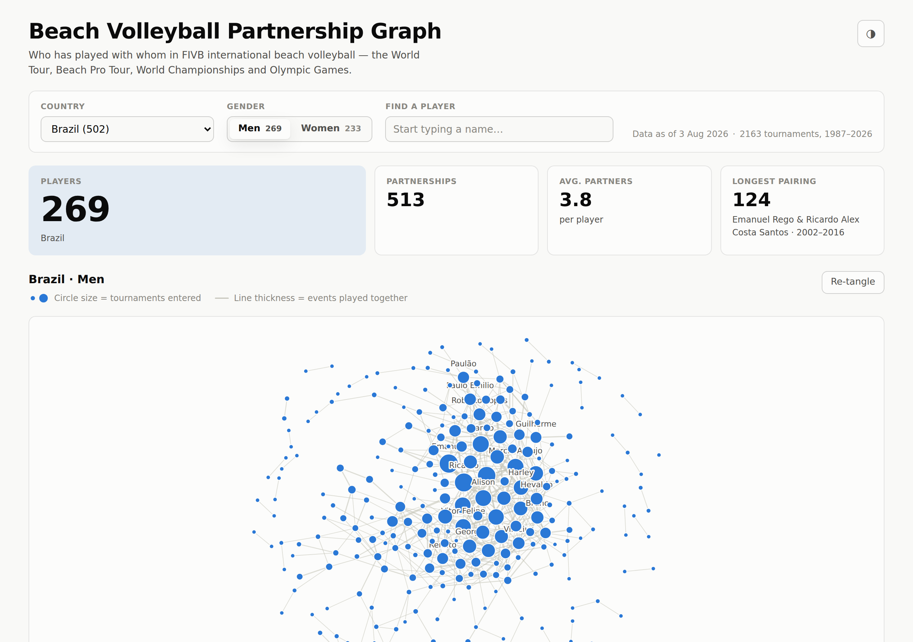

# Beach Volleyball Partnership Graph

Pick a country and gender, and see every player who has competed in FIVB
international beach volleyball, linked to the partners they have played with.

Data comes from the official [FIVB VIS Web Service][vis] and is rebuilt weekly.

[vis]: https://www.fivb.org/VisSDK/VisWebService/



---

## What counts as a tournament

Only **FIVB-organised international** competition:

| Tier | Events |
|---|---:|
| FIVB World Tour (1987–2021) | 1,517 |
| Beach Pro Tour (2022–) | 506 |
| Age-group World Championships | 88 |
| World Championships | 30 |
| Olympic Games (incl. Youth, and Olympic qualifiers) | 22 |

Continental tours and championships (CEV, AVC, NORCECA, CSV, CAVB), national
tours, snow volleyball, multi-sport games and King of the Court are all
excluded.

VIS records an `OrganizerType` and a `Type` per tournament. `OrganizerType = 1`
(FIVB) is necessary but **not** sufficient — FIVB is listed as organiser for a
number of continental championships, zonal tours, seminars and test events. So
the filter is `OrganizerType = 1` *and* an explicit allowlist of `Type` values.
Every kept tournament carries its tier through to `manifest.json`, so the filter
is auditable from the published output.

See [`ingest/tiers.ts`](ingest/tiers.ts) — the allowlist is one table, and
everything deliberately excluded is listed there with a reason.

> **Age-group world championships** (U17–U23) are included by default: they are
> FIVB world-level events. Set `INCLUDE_AGE_GROUP=false` to restrict the graph
> to the senior game.

## How a graph is built

1. **Tournaments** — one `GetBeachTournamentList` call, filtered to the tier
   allowlist.
2. **Players** — one `GetPlayerList` call. Deliberately *unfiltered*: several
   thousand players who entered FIVB beach events are not flagged `PlaysBeach`
   in VIS, and filtering on it silently drops their partnerships.
3. **Entries** — one `GetBeachTeamList` call returns all ~205,000 team entries.
4. **Aggregate** — collapse entries into weighted edges keyed by a canonical
   unordered pair, `min(id):max(id)`.
5. **Slice** — group by country × gender and write one file per slice.

The entire FIVB archive is reachable in **three bulk requests** (~36 MB, about
11 seconds). There is no per-tournament fan-out, no rate-limit pacing and no
incremental cache — a full rebuild every week is cheap and self-healing.

### Counting rules

- One team entry = one tournament for that pair. A pair that appears in both
  the qualification and the main draw of the same event counts **once** (edges
  hold a set of tournament numbers, not a counter).
- Self-pairs, entries with a missing second player (withdrawals and
  placeholders) and entries referencing unknown players are dropped and counted
  in the ingest log.
- A player's country is their **current** federation. No federation history is
  kept.
- **Both endpoints must be in the slice.** A partnership between a Brazilian and
  an Argentine appears in neither country's graph. Measured against the live
  archive that is ~1% of all partnerships.

### Why the default graph looks so sparse

Across the whole dataset the mean is only 2.4 partners per player — but the
median player has **one** partner and **two** tournaments, because the archive
is dominated by one-off entrants:

| Population | Players | Mean partners | Median |
|---|---:|---:|---:|
| Everyone | 15,628 | 2.4 | 1 |
| ≥3 tournaments | 7,634 | 3.8 | 3 |
| ≥10 tournaments | 3,821 | 5.3 | 5 |
| ≥50 tournaments | 1,279 | 7.4 | 7 |

53.8% of players have exactly one partner and 37.4% entered exactly one
tournament, ever. Career players behave the way you would expect — around five
partners — and the **Min. events together** filter is the quickest way to see
only them.

## Published data contract

Everything under `/v1/` is static JSON:

```
/v1/manifest.json            index: countries, node counts, tiers, freshness
/v1/graphs/{CC}-{G}.json     nodes + edges for one country × gender
/v1/players/{CC}-{G}.json    photo / height / date of birth for that slice
```

Edge keys are terse (`a`, `b`, `t`, `f`, `l`) because edges dominate file size.
Player detail is a **separate file per slice**, not per player: it loads once
alongside the graph, so opening a profile costs no network request, and a
country's detail file is ~120 KB at worst.

The schema is [`web/src/schema.ts`](web/src/schema.ts), shared verbatim by the
ingest pipeline and the app so the two cannot drift.

Breaking the schema means writing `/v2/` and cutting the frontend over — no
coordinated deploy.

## Reading the graph

- **Circle size** — tournaments that player entered, area-proportional. (Not
  their partner count — that is in the tooltip and the table.)
- **Line thickness** — events that pair played together.
- **Min. events together** — hides partnerships below the threshold, and the
  players left with no remaining partnership. Node size still reflects each
  player's full career, because that is a property of the player rather than of
  the edges on screen.
- **Hover or focus a player** to highlight their partners; **click** for the
  full profile.
- Drag to pan, scroll to zoom, `Fit` to reframe.
- The **table below the graph** is the accessible twin: every value the graph
  encodes visually is sortable text there, with no pointer required.

Graph labels use the name a player actually competes under ("Emanuel",
"Alison") rather than their full legal name, and are thinned by collision so
they stay readable.

Photos come straight from FIVB's image service and simply do not exist for many
players; those fall back to an initials avatar. Always request them with a
`width` — without one FIVB serves the 2–3 MB original, with one you get a
resized WebP of about 10 KB. Photo and profile URLs are derived from the player
id in `schema.ts` rather than stored per player, which keeps the slice files
roughly 60% smaller.

## Running it

```bash
npm install
npm run ingest     # ~11s: fetches FIVB data into web/public/v1/
npm run dev        # http://localhost:5173
```

Other scripts:

```bash
npm test           # unit tests for the ingest logic and formatters
npm run typecheck
npm run build      # production build into dist/
```

Generated data is **not committed** — `npm run ingest` reproduces it, and CI
regenerates it on every deploy.

## Deployment

`.github/workflows/deploy.yml` runs weekly (Sundays 03:17 UTC), on pushes to
`main`, and on demand via *Run workflow*. It typechecks, tests, ingests, builds
and deploys to GitHub Pages.

To enable it: **Settings → Pages → Source → GitHub Actions**.

If the ingest step fails the job stops before deploying, so the previously
published site keeps serving last week's data — the failure notification from
Actions is the whole monitoring story.

The ingest also refuses to publish if the data looks wrong (no qualifying
tournaments, or fewer than 1,000 aggregated partnerships), and writes to a temp
directory that is only swapped into place once every file exists — so a
half-published state is not reachable.

### Being a good citizen of the API

VIS is free and unmetered. This project sends three requests a week. If you fork
it, set a real contact address in `VIS_USER_AGENT` and request an application
identifier from `vis.sdk@fivb.org`.

## Layout

```
ingest/     the weekly pipeline (VIS client, tier allowlist, aggregation)
web/src/    the app (schema, force layout, components)
```
